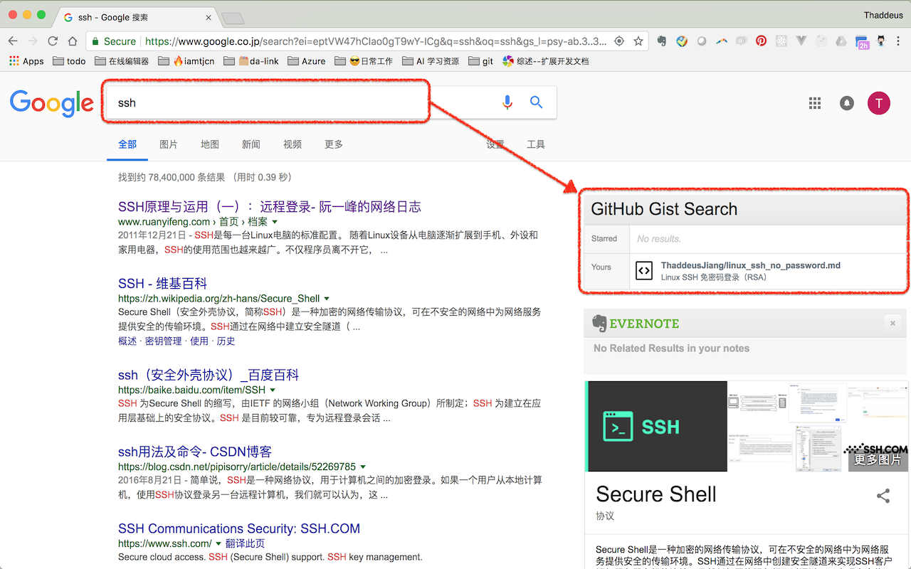
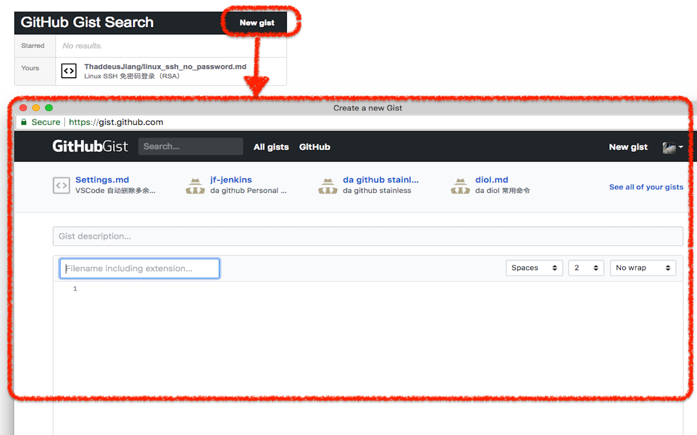

# Chrome Extension GitHub Gist Search

[](https://travis-ci.org/ThaddeusJiang/chrome-extension-github-gist-search)

This is a chrome extension, search for your GitHub Gist by Chrome search box.

## Install
[chrome web store](https://chrome.google.com/webstore/detail/github-gist-search/mamcpimmmcfjddbnldmnbajnknjjdhkk)

## Feature
- Search


- New gist


## Dev
- clone
```
$ git clone https://github.com/ThaddeusJiang/chrome-extension-github-gist-search.git
```

- debug
open `chrome://extensions/` in chrome.

click `Load unpacked`.
